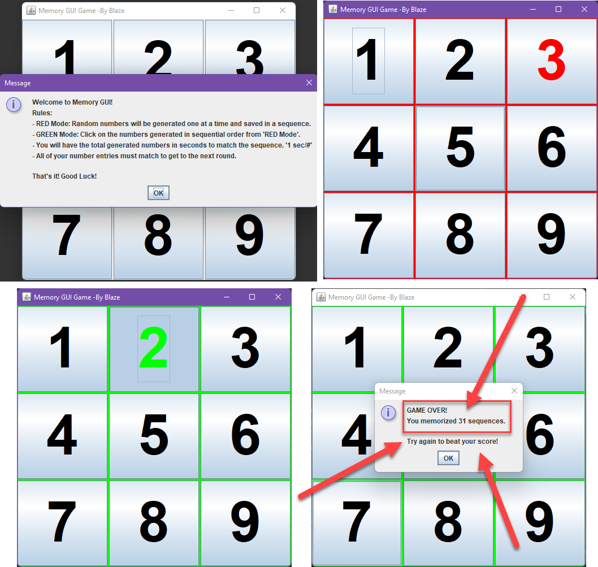

# Memory-GUI-Game
 
I made a GUI game that creates a  GridLayout for nine JButton's! 
The game is to test your memory in seeing a sequence of random generated numbers that click numbered buttons and add them to a sequence that you have to keep track of, 
with limited time to respond. First the JFrame is constructed, which calls the initComponents() method to build and add the panel and buttons, 
and moves into the play() method that has a gameover false loop, that will call a random number generator I call this RED Mode, 
I have disabled the MouseListener so that no one can cheat. Then the players turn activates and I call it GREEN Mode, 
where you only have a second per number saved to match what the 'GUI Says' haha!

While making this I ran it often to make sure my changes were making progress, and I happened to get a really high score of 31! 

See if you can beat it! --->> Just download the .exe file!

