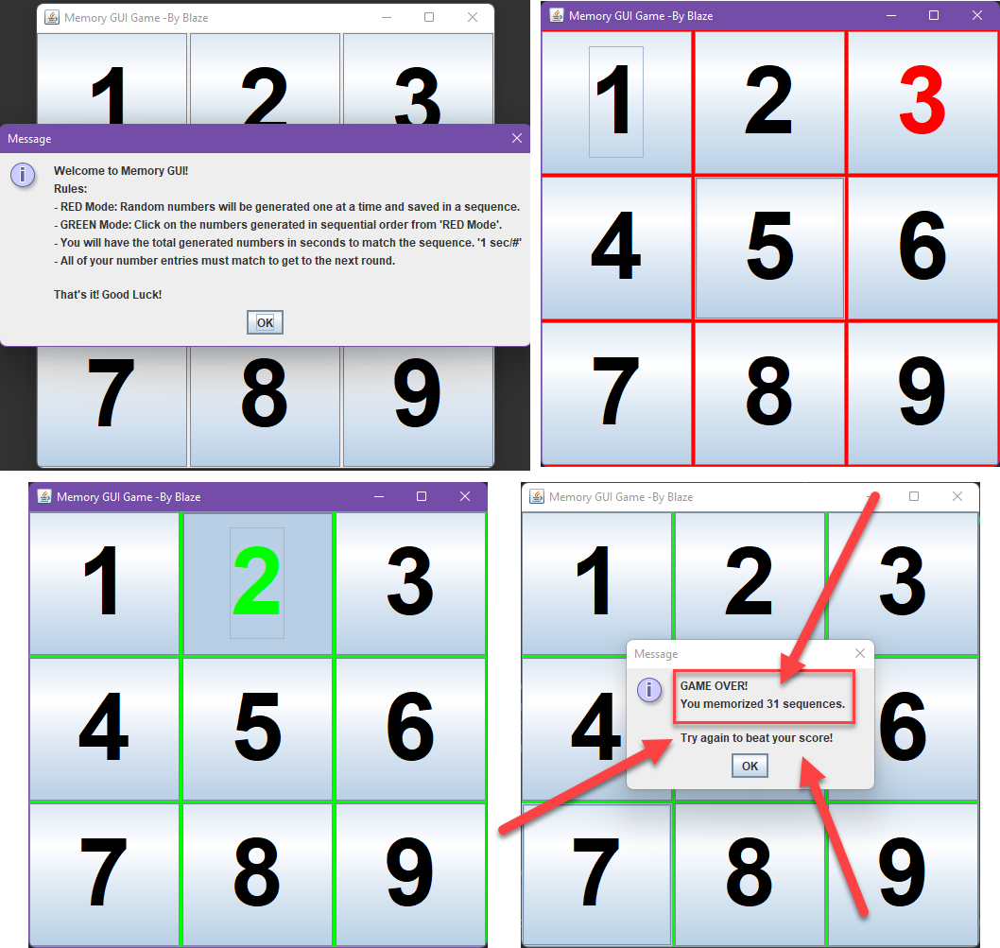

# Memory GUI Game - Java Swing Pattern Memory Application

An event-driven desktop application built in Java Swing designed to test memory recall using dynamically generated visual sequences. The application manages state-driven game modes, timed sequence loops, dynamic button layouts, and user input validation.

## Core Features & Architecture

* Graphical User Interface: Built using `JFrame` and a $3 \times 3$ `GridLayout` managing nine interactive `JButton` components.

* State Management Engine: Toggles between display ("RED Mode") and user interaction ("GREEN Mode") states to enforce strict sequence progression and rule compliance.

* Dynamic Sequence Generation: Generates pseudo-random numerical sequences stored in memory for runtime state comparison.

* Event-Driven Input Handling: Leverages `MouseListener` and event state controls to manage active response windows, prevent input spoofing during generation phases, and validate turn logic.

* Executable Packaging: Configured with pre-packaged output files (`.jar` and `.exe`) bundled with JRE configurations for standalone desktop operation.

## Key Technical Focus Areas

* GUI Layout & Component Lifecycle: Custom initialization (`initComponents()`), container repainting (`revalidate()`), and dynamic visual state updates.

* Input Validation & State Control: Disabling dynamic listeners during program-driven display phases to lock input handling until the evaluation phase.

* Programmatic Timing: Enforcing timed per-number input windows during evaluation states.

## Tech Stack

* Language: Java

* Framework: Java Swing / AWT

* Concepts: Event-Driven Architecture, GUI State Machines, Layout Managers, Standalone Distribution

#

